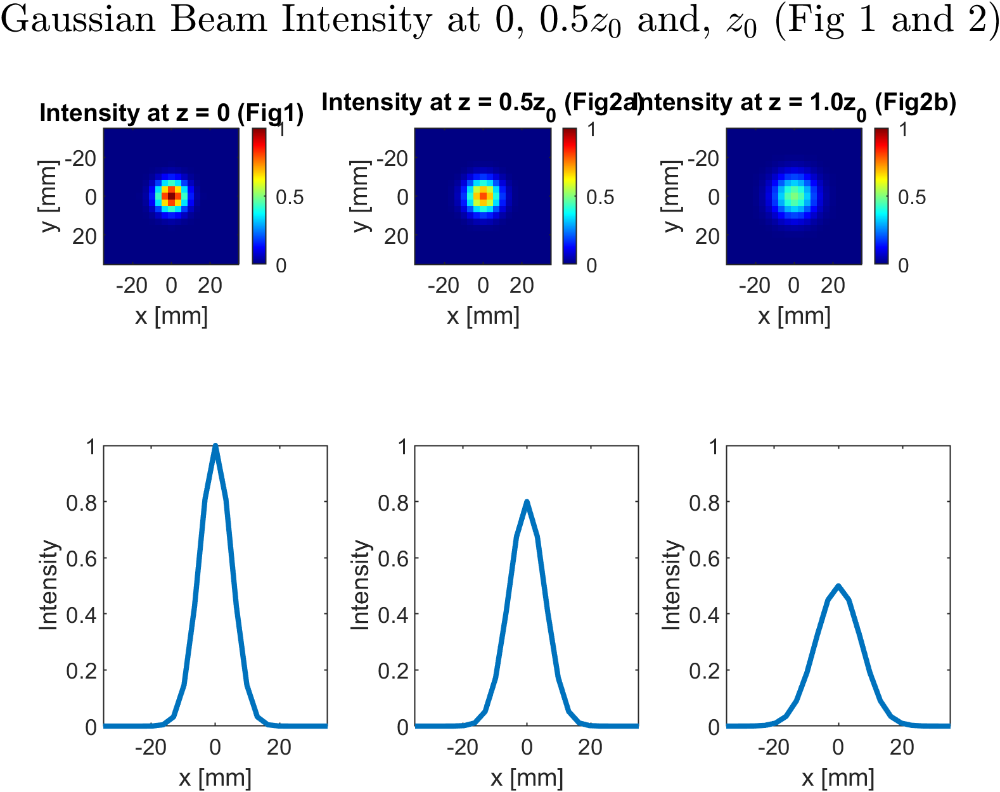
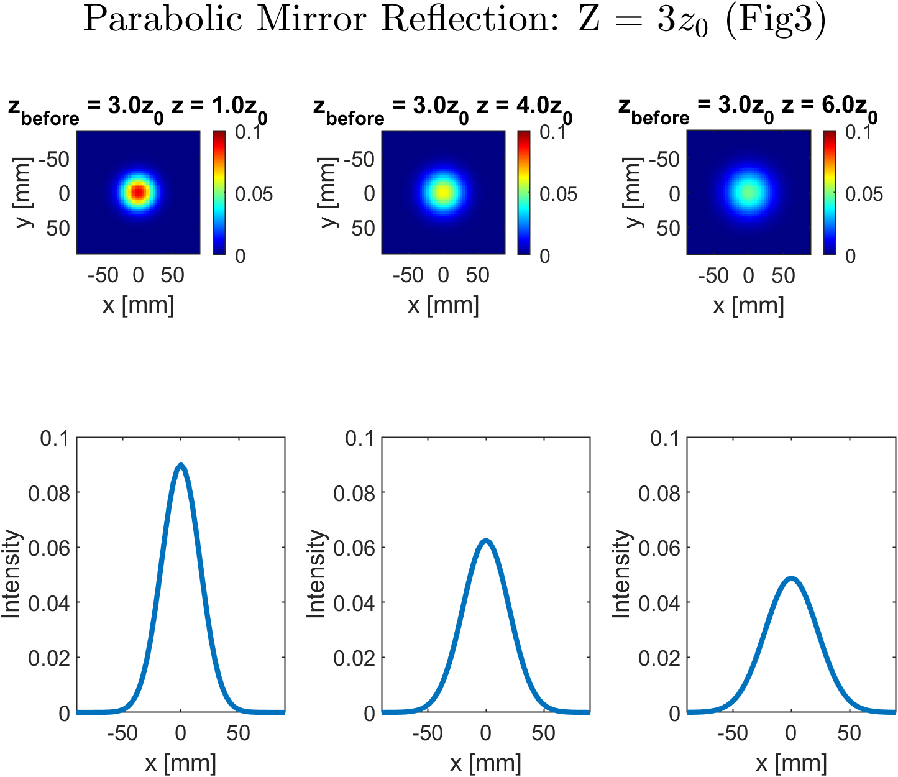
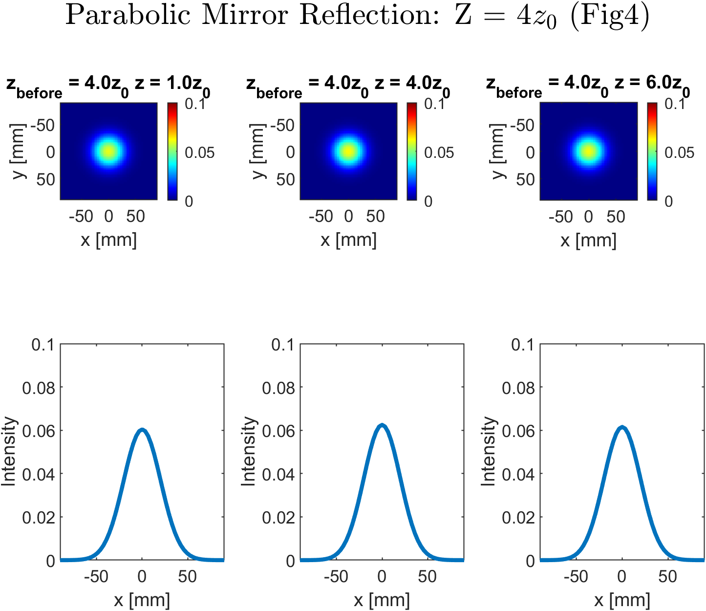
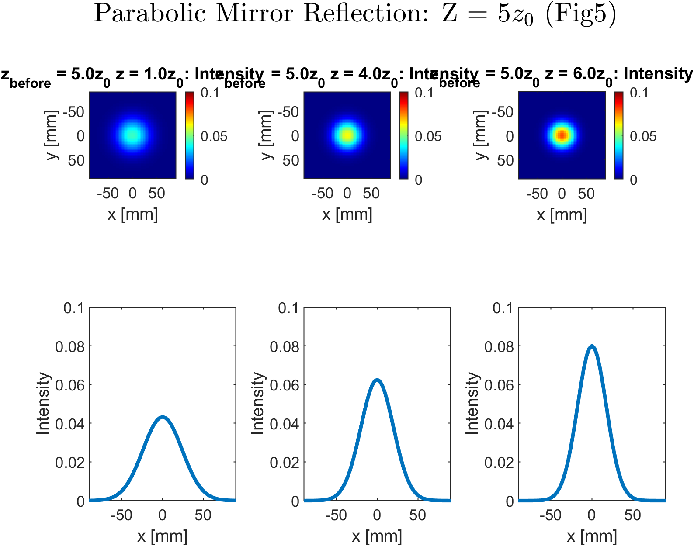

# Simulation of Gaussian Beam Propagation and Reflection Using the Angular Spectrum Method

A MATLAB-based numerical simulation demonstrating Gaussian beam propagation through free space and its interaction with a parabolic mirror using Fourier optics principles.

---

## Overview

This project implements the angular spectrum method to model the paraxial propagation of a Gaussian laser beam and its reflection from a concave parabolic mirror. The simulation visualizes key optical phenomena including beam divergence, intensity decay, wavefront curvature evolution, and focusing behavior.

---

## Features

- **Free-Space Propagation**: Simulates Gaussian beam evolution through free space using the angular spectrum approach
- **Parabolic Mirror Reflection**: Models beam interaction with a concave parabolic reflector
- **Multiple Scenarios**: Analyzes three distinct mirror positions demonstrating diverging, collimating, and converging behaviors
- **Comprehensive Visualization**: Generates 2D intensity distributions and 1D cross-sectional profiles
- **Theoretical Validation**: Results confirm theoretical predictions for beam width expansion and intensity decay

---

## Physical Parameters

| Parameter | Symbol | Value | Description |
|-----------|--------|-------|-------------|
| Wavelength | λ | 4.2 mm | Electromagnetic wave wavelength |
| Beam Waist | w₀ | 10 mm | Minimum beam radius at z = 0 |
| Rayleigh Range | z₀ | 7.48 mm | Beam collimation distance |
| Mirror Focal Length | f | -4z₀ | Concave parabolic mirror |

---

## Theoretical Background

### Gaussian Beam Propagation

The simulation is based on fundamental Gaussian beam properties:

- **Beam Width Evolution**: `W(z) = w₀√(1 + (z/z₀)²)`
- **Intensity Decay**: `I(0,z) = I₀/[1 + (z/z₀)²]`
- **Wavefront Curvature**: `R(z) = z[1 + (z₀/z)²]`

### Angular Spectrum Method

The propagation algorithm decomposes the beam into plane wave components via Fourier transform, applies phase propagation in the frequency domain, and reconstructs the field through inverse Fourier transform.

---

## Key Results

### Free-Space Propagation

The simulation tracks beam evolution at three critical distances:

- **z = 0**: Minimum beam width (10 mm) with maximum intensity
- **z = 0.5z₀**: Intermediate expansion to ~11.2 mm width
- **z = z₀**: Significant broadening to ~14.1 mm with halved intensity

### Parabolic Mirror Reflection

Three distinct behaviors emerge based on mirror position:

1. **Mirror at z = 3z₀**: Produces continued beam divergence after reflection
2. **Mirror at z = 4z₀**: Creates optimal collimation with uniform beam width
3. **Mirror at z = 5z₀**: Generates strong focusing with beam convergence

---

## Requirements

- MATLAB R2016b or later
- No additional toolboxes required

---

## Installation

```bash
git clone https://github.com/Ammar-Wahidi/Simulation-of-Gaussian-Beam-Propagation-and-Reflection-Using-the-Angular-Spectrum-Method.git
cd Simulation-of-Gaussian-Beam-Propagation-and-Reflection-Using-the-Angular-Spectrum-Method
```

---

## Repository Structure

```
📁 Simulation-of-Gaussian-Beam-Propagation-and-Reflection-Using-the-Angular-Spectrum-Method/
├── 📄 README.md                        # This file
├── 📄 EMW_Report.pdf                   # Complete technical report
├── 📄 GaussianBeamSimulation.m         # Main MATLAB simulation script
├── 📄 Gaussian_Beams_Live_Script.mlx   # MATLAB Live script Simulation
└── 📁 results/                         # Generated figures and outputs
    ├── Fig1_BeamWaist.png
    ├── Fig2_Mirror_3z0.png
    ├── Fig3_Mirror_4z0.png
    └── Fig4_Mirror_5z0.png
```

---

## Usage

### Quick Start

1. Open MATLAB and navigate to the repository directory
2. Run the main simulation:

```matlab
run('GaussianBeamSimulation.m')
```

The script will automatically:
- Display simulation parameters in the command window
- Generate free-space propagation plots (Figure 1)
- Create three parabolic mirror reflection analyses (Figures 2-4)
- Show intensity distributions for all cases

Or for better visualization download live script `Gaussian_Beams_Live_Script.mlx` and run it

---

## Output Visualizations

The simulation generates four main figure windows:

### Figure 1: Free-Space Propagation
Shows Gaussian beam intensity at three distances:
- **z = 0**: Beam waist position (minimum width, maximum intensity)
- **z = 0.5z₀**: Half Rayleigh range (moderate expansion)
- **z = z₀**: Full Rayleigh range (√2 times beam waist)


### Figures 2-4: Parabolic Mirror Reflection
Each figure analyzes post-reflection propagation at three distances (z₀, 4z₀, 6z₀):
- **Figure 2**: Mirror at z = 3z₀ (diverging behavior)
- **Figure 3**: Mirror at z = 4z₀ (collimating behavior)
- **Figure 4**: Mirror at z = 5z₀ (focusing behavior)




**Each figure contains:**
- 2D intensity distribution color maps 
- 1D cross-sectional intensity profiles along x-axis (Slice)

---

## Team


- Ziad Maged Mahmoud Mohamed 
- Ammar Ahmed Wahidi 
- Mostafa Gamal Eldin Mostafa Ahmed 

---

## References

1. Bahaa E. A. Saleh and Malvin Carl Teich, "Fundamentals of Photonics", 2nd Edition, John Wiley and Sons, Inc., ISBN 978-0-471-35832-9
2. VisuPhy: Gaussian Beam Simulator
3. Ray Optics Simulation - https://phydemo.app/ray-optics/simulator/
4. Laser Beam Shaping: Theory and Techniques (2000) by Fred Dickey and Scott Holswade

